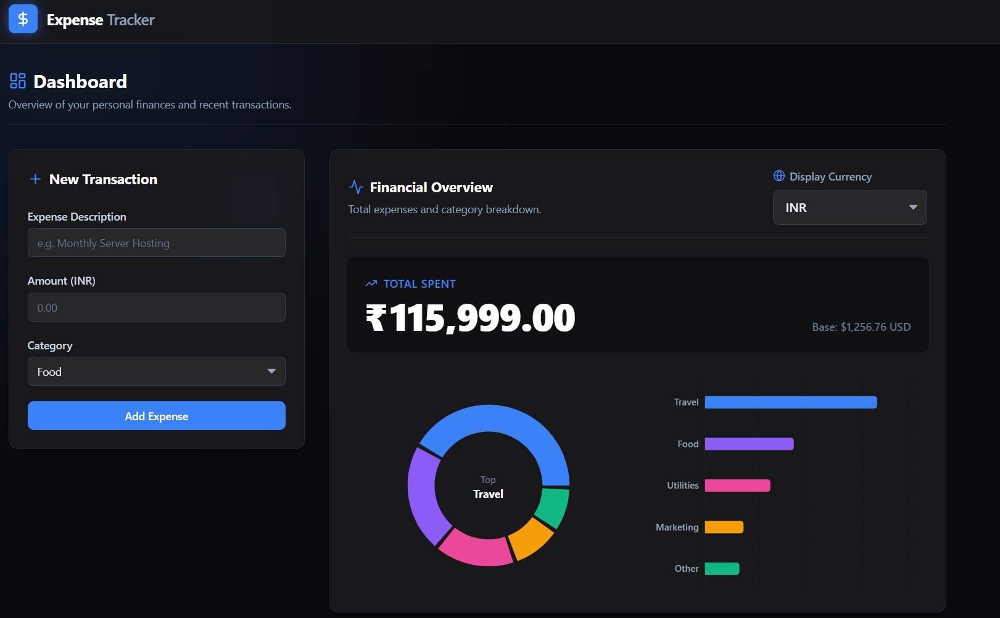

## Expense Tracker Dashboard

## 🔍 Overview
**Expense Tracker Dashboard** is a crisp, interactive personal finance web application designed to visually log, categorize, and manage your expenses. Built with **React**, **Vite**, **Recharts**, **Framer Motion**, and the **Frankfurter API**, this project transforms standard expense keeping into a satisfying, feature-rich experience—including live global currency conversion, dynamic statistical insights, and smooth fluid animations. 
Perfect for personal management or developers looking to build full-featured, modular clean React applications.

## 📸 Screenshot
 

## ✨ Features
  -  **Interactive Finances** – Clean, responsive tabular format for all categorized transactions.
  -  **Live Currency Conversion** – Seamlessly switch base viewing currencies utilizing the Frankfurter API with an instant refresh across all numeric views.
  -  **Advanced Periodic Filtering** – Sort expenses gracefully by Today, This Week, This Month, This Quarter, Half Yearly, Annually, or dynamically jump back into historical specific months.
  -  **Analytical Graph Dashboard** – Beautiful, interactive React charts breaking down spending habits visually using Recharts (Pie & Bar views).
  -  **Spending Trend Analysis** – Dedicated Line Chart that conditionally appears to visualize broad financial trends over extended periods.
  -  **Transaction Editing** – Effortlessly correct past mistakes via a sleek, frosted-glass Modal overlay while preserving standard insertion flows.
  -  **Smart Inputs** – Dynamically converts entered foreign amounts exactly back to a base USD storage, eliminating accounting discrepancies automatically.
  -  **State Preservation** – Complete context-driven state management securely persisted to LocalStorage without complex third-party tools.
  -  **Advanced Animations & WOW Factor** – Fluid dashboard entries using Framer Motion, satisfying CountUp animations on the balance sheet, and a celebratory Confetti burst when successfully logging expenses!
  -  **Professional SaaS Aesthetics** – Implemented deeply subtle ambient lighting, crisp typography (Inter), and a structured Flex/Grid layout.
  -  **Fully Responsive Design** – Resizes dynamically with adjusted chart diameters to look native on both desktop and mobile screens, featuring totally hidden scrollbars while maintaining gesture navigation.
    
## 🧠 How It Works
  - The app uses **Vite** as a lightning-fast build tool to serve the React application.
  - State is managed natively through a unified `ExpenseContext` to wrap the application logic efficiently.
  - The **Frankfurter API** fetches live exchange rates, allowing the user to select their desired rendering currency from a global list dynamically.
  - The **Recharts** integration aggregates expense category numeric data into clean layout metrics, plus Line Charts for chronological trending.
  - **Framer Motion** encapsulates major components to trigger staggering layout animations correctly on browser paint and unmounts.
    
## 🛠️ Built With
  - **React 18** – Core frontend UI library
  - **Vite** – Next-generation frontend tooling and bundler
  - **Recharts** – Composable charting library
  - **Framer Motion** – Production-ready physics animations for React
  - **React CountUp** – Animated visual counts for number transitions
  - **Lucide React** – Clean, SVG-based iconography
  - **Tailwind CSS v4** – Utility-first comprehensive styling framework
    
## 🧰 Getting Started
To run the Expense Tracker Dashboard locally:

### Prerequisites
- Node.js (v16+ recommended)
- npm or yarn package manager

### Installation & Run
1. **Clone the Repository:**
   ```bash
   git clone https://github.com/Poorna-Sai-Sriharsha/Expense-Tracker.git
   ```
2. **Navigate to the Project Directory:**
  ```bash
   cd Expense-Tracker
  ```
3. **Install Dependencies:**
   ```bash
   npm install
   ```
4. **Run the App:**
   ```bash
   npm run dev
   ```
5. **Open Your Browser:**
   Go to → `http://localhost:5173` (or the port specified by Vite in your terminal).
   You now have a fully functional Expense Tracker running locally!

## 🧪 Testing
  - Tested on modern environments (Node >= 16)
  - Verified rendering in Chrome, Firefox, Edge, and Safari
  - Fully responsive design confirmed on mobile and tablet screens wrapping charts without overlap.

## 📖 What I Learned
  - Working reliably with generic free APIs (Frankfurter) for financial utility integration.
  - Calculating dynamic SVG bounds accurately dynamically to ensure Recharts don't overlap within Flex containers.
  - Applying robust React Context logic combined cleanly with raw LocalStorage.
  - Implementing polished animations directly inside the React Virtual DOM lifecycle to provide standard, high-level SaaS interactions.
  - Formulating advanced inputs that natively parse currencies underneath the hood correctly regardless of user presentation view.

## 🤝 Contributing
Contributions are welcome! If you have ideas for new features or improvements, feel free to fork the repository and submit a pull request. For major changes, please open an issue first to discuss what you would like to change.
